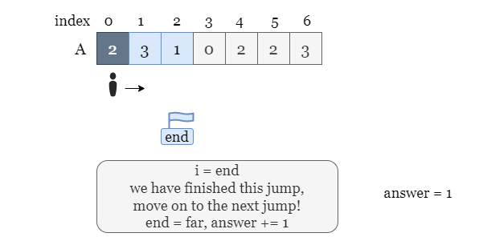

#### Approach 1: Greedy

**Intuition**

Let's say that we're at the $i^{th}$ jump which has a value of $3$, so we have 3 possible destinations for this jump, and the value of the destinations are $3$, $5$, and $2$. All the indexes covered by these ranges are the reachable indexes after this jump, as the green cells show in the picture below.


If we move on to the jump `i + 1`, the choices of starting indices for jump `i + 1` is exactly the reachable indexes of the jump `i`.

We can go on and draw the starting range of the jump `i + 1` and so on, the starting index of each jump is shown in the following picture. With the increase in the number of jumps, our forward distance is also increasing, the first jump that brings us to the last cell is the jump we should choose. It is a workable method, but what is the time complexity?


Since we are guaranteed to reach the last index, the starting range of each jump is always larger than its previous jump (otherwise, we would be stuck at a jump forever). Given the length of `nums` as `n`, in the worst case, we may have $n$ jumps and $O(n^2)$ total updates, which is shown by the area of the blue part of the figure below. Considering the maximum size of the input array, an approach with $O(n^2)$ time complexity is likely to end up with Time Limit Exceeded!


Let's try an advanced approach to reduce the time complexity. Unlike the previous idea, we don't need to consider all of the updates. Take the first jump at index `0` for example, suppose the starting indexes of jump `0` are in the range `[0, 2]`. When looking for the starting indexes of the next jump, do we still consider the range `[0, 2]`? The answer is NO!

We want to reach the ending position by using the least number of jumps possible, so there is no reason in reaching an index using more jumps. Therefore, we shall take a greedy approach that tries to reach each index using the least number of jumps and ignore updates that are destined to end in more jumps.

Now back to the example, even if we can move to `[0, 2]` in jump `1`, we would not consider doing so since we already covered that range with jump `0`. So the valid range of reachable indexes for jump `1` is `[3, 4]` instead of `[0, 4]`.


In short, if we can reach an index using `j` jumps, we will never consider reaching it using more than `j` jumps. So the updates marked in red will never be considered, because they represent reaching an index with more jumps.


We need two auxiliary marks to help delimit ranges and to avoid repeated visits to the same range:

- `end` is the furthest starting index of the current jump.
- `far` is the furthest reachable index of the current jump.

Once we have finished iterating over the range of the current jump (we reach index `end`), the next step is to continue iterating over the reachable indexes that are larger than `end`, which is represented by the range `[end + 1, far]`. We skip the overlapped range (marked in red) using the greedy approach mentioned before.


Let's use the following slides as a detailed example:





To summarize: the current jump ends when we reach index `end`. Between the current index and `end`, we find the farthest reachable index `far`. At the end of the current jump, we increment our answer and set `end = far` for the next jump.

**Algorithm**

- Initialize `curEnd = 0`, `curFar = 0` and the number of jumps as `answer = 0`.
- Interate over `nums`, for each index `i`, the farthest index we can reach from `i` is `i + nums[i]`. We update `curFar = max(curFar, i + nums[i])`.
- If `i = curEnd`, it means we have finished the current jump, and should move on to the next jump. Increment `answer`, and set `curFar = curEnd` as the furthest we can reach with the next jump. Repeat from step 2.

**Implementation**

<details>
  <summary><b>C++</b></summary>

``` c++
class Solution {
public:
    int jump(vector<int>& nums) {
        // The starting range of the first jump is [0, 0]
        int answer = 0, n = int(nums.size());

        int curEnd = 0, curFar = 0;
        
        for (int i = 0; i < n - 1; ++i) {
            // Update the farthest reachable index of this jump.
            curFar = max(curFar, i + nums[i]);

            // If we finish the starting range of this jump,
            // Move on to the starting range of the next jump.
            if (i == curEnd) {
                answer++;
                curEnd = curFar;
            }
        }
        
        return answer;
    }
};
```
</details>
<details>
  <summary><b>Java</b></summary>

``` java
class Solution {
    public int jump(int[] nums) {
        // The starting range of the first jump is [0, 0]
        int answer = 0, n = nums.length;
        int curEnd = 0, curFar = 0;
        
        for (int i = 0; i < n - 1; ++i) {
            // Update the farthest reachable index of this jump.
            curFar = Math.max(curFar, i + nums[i]);

            // If we finish the starting range of this jump,
            // Move on to the starting range of the next jump.
            if (i == curEnd) {
                answer++;
                curEnd = curFar;
            }
        }
        
        return answer;
    }
}
```
</details>
<details>
  <summary><b>Python 3</b></summary>

``` python
class Solution:
    def jump(self, nums: List[int]) -> int:
        # The starting range of the first jump is [0, 0]
        answer, n = 0, len(nums)
        cur_end, cur_far = 0, 0
        
        for i in range(n - 1):
            # Update the farthest reachable index of this jump.
            cur_far = max(cur_far, i + nums[i])

            # If we finish the starting range of this jump,
            # Move on to the starting range of the next jump.
            if i == cur_end:
                answer += 1
                cur_end = cur_far
                
        return answer
```
</details>

**Complexity Analysis**

Let $n$ be the length of the input array `nums`.

- Time complexity: $O(n)$
: We iterate over `nums` and stop at the second last element. In each step of the iteration, we make some calculations that take constant time. Therefore, the overall time complexity is $O(n)$.
- Space complexity: $O(1)$
: In the iteration, we only need to update three variables, `curEnd`, `curFar` and `answer`, they only take constant space.