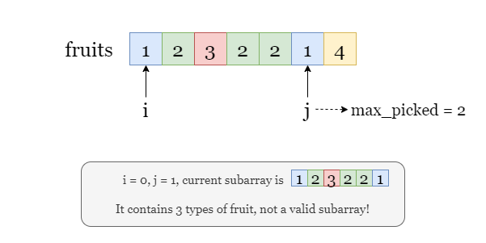
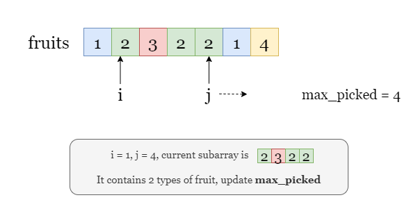
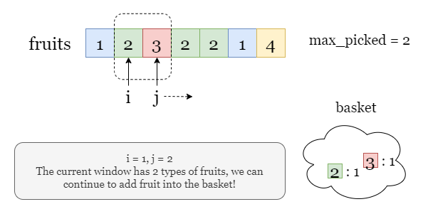
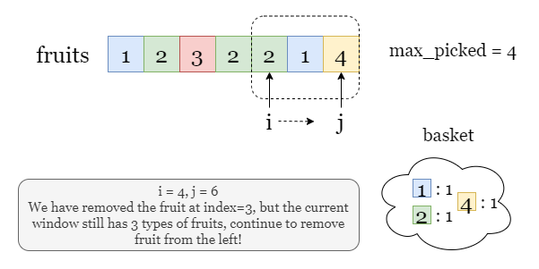

#### Overview

In this problem, we are given an input array representing different types of fruits and two baskets.


We want to collect some fruits from a subarray. However, each basket can only hold one type of fruit. In other words, we can collect **at most 2 types of fruits**.

Take the picture below as an example:


The task is to find out the **maximum number of fruits** we can collect under this premise.

To start with, we focus on the mathematical part of the problem, this question equals: Given an array of integers, find the longest subarray that contains at most 2 unique integers. (We will call such subarray a valid subarray for convenience)
<br>

#### Approach 1: Brute Force

**Intuition**

Let's start with the most straightforward method, brute force! That is, to check every subarray and find out the longest valid one.

The steps are simple:

1. Iterate over all subarrays.
2. For each subarray, we count the types of fruits it contains. If the subarray has no more than 2 types of fruits, meaning it is valid, we take its length to update the maximum length.

Take the following slides as an example:





**Algorithm**

1. Initialize `max_picked = 0` to track the maximum number of fruits we can collect.
2. Iterate over the left index `left` of subarrays.
3. For every subarray start at index `left`, iterate over every index `right` to fix the end of subarray.
4. For each subarray `(left, right)`, count the types of fruits it contains.
  - If there are no more than 2 types, this subarray is valid, we take its length to update `max_picked`.
  - Otherwise, if the current subarray is invalid, we move on to the next subarray.
5. Once we finish the iteration, return `max_picked` as the maximum number of fruits we can collect.

**Implementation**

<details>
  <summary><b>C++</b></summary>

``` c++
class Solution {
public:
    int totalFruit(vector<int>& fruits) {
        // Maximum number of fruits we can pick
        int maxPicked = 0;
        
        // Iterate over all subarrays (left, right)
        for (int left = 0; left < fruits.size(); ++left) {
            for (int right = 0; right < fruits.size(); ++right) {
                // Use a set to count the type of fruits.
                set<int> basket;
                
                // Iterate over the current subarray.
                for (int currentIndex = left; currentIndex <= right; ++currentIndex) {
                    basket.insert(fruits[currentIndex]);
                }
                
                // If the number of types of fruits in this subarray (types of fruits) 
                // is no larger than 2, this is a valid subarray, update 'maxPicked'.
                if (basket.size() <= 2) {
                    maxPicked = max(maxPicked, right - left + 1);
                }
            }
        }
        
        // Return 'maxPicked' as the maximum length (maximum number of fruits we can pick).
        return maxPicked;
    }
};
```
</details>
<details>
  <summary><b>Java</b></summary>

``` java
class Solution {
    public int totalFruit(int[] fruits) {
        // Maximum number of fruits we can pick
        int maxPicked = 0;
        
        // Iterate over all subarrays (left, right)
        for (int left = 0; left < fruits.length; ++left) {
            for (int right = 0; right < fruits.length; ++right) {
                // Use a set to count the type of fruits.
                Set<Integer> basket = new HashSet<>();
                
                // Iterate over the current subarray.
                for (int currentIndex = left; currentIndex <= right; ++currentIndex) {
                    basket.add(fruits[currentIndex]);
                }
                
                // If the number of types of fruits in this subarray (types of fruits) 
                // is no larger than 2, this is a valid subarray, update 'maxPicked'.
                if (basket.size() <= 2) {
                    maxPicked = Math.max(maxPicked, right - left + 1);
                }
            }
        }
        
        // Return 'maxPicked' as the maximum length (maximum number of fruits we can pick).
        return maxPicked;
    }
}
```
</details>
<details>
  <summary><b>Python 3</b></summary>

``` python
class Solution:
    def totalFruit(self, fruits: List[int]) -> int:
        # Maximum number of fruits we can pick
        max_picked = 0
        
        # Iterate over all subarrays: left index left, right index right.
        for left in range(len(fruits)):
            for right in range(left, len(fruits)):
                # Use a set to count the type of fruits.
                basket = set()
                
                # Iterate over the current subarray (left, right).
                for current_index in range(left, right + 1):
                    basket.add(fruits[current_index])
                    
                # If the number of types of fruits in this subarray (types of fruits) 
                # is no larger than 2, this is a valid subarray, update 'max_picked'.
                if len(basket) <= 2:
                    max_picked = max(max_picked, right - left + 1)
        
        # Return 'max_picked' as the maximum length (maximum number of fruits we can pick).
        return max_picked
```
</details>

**Complexity Analysis**

Let $n$ be the length of the input array `fruits`.

- Time complexity: $O(n^3)$
  - We have three nested loops, the first loop for the left index `left`, the second loop for the right index `right`, and the third loop for the index `currentIndex` between `left` and `right`.
  - In each step, we need to add the current fruit to the set `basket`, which takes constant time.
  - For each subarray, we need to calculate the size of the `basket` after the iteration, which also takes constant time.
  - Therefore, the overall time complexity is $O(n^3)$.

- Space complexity: $O(n)$
  - During the iteration, we need to count the types of fruits in every subarray and store them in a hash set. In the worst-case scenario, there could be $O(n)$ different types in some subarrays, thus it requires $O(n)$ space complexity.
  - Therefore, the overall space complexity is $O(n)$.
<br>

#### Approach 2: Optimized Brute Force

**Intuition**

There are 3 nested loops in approach 1, so as tons of duplicated calculations. Let's try a better method to reduce the workload!

**No inner loop**

Let's look at the subarrays generated in every iteration.

For every consecutive subarray, the only difference is that the second subarray has one added fruit, while the rest fruits are the same! Therefore, to get the types of fruits in the second subarray, we just need to add the new fruit to the `basket` of the first subarray, rather than initializing an empty set and recounting all the fruits again!


Early stop Take a look at the picture below, suppose the iteration of `right` stops by here, do we need to continue the iteration of `right` until it reaches the end of the array?


No! Since the current window already has more than 2 types of fruits, adding more fruits from the right side does not decrease the number of types, which means that the rest of the windows also have more than 2 types of fruits. Hence, it is time to stop iterating over `right`, and start over from the next `left`.

Therefore, we only need two nested loops, the outer loop for the `left` index left and the inner loop for the right index `right`. Take the following slides as an example:





**Algorithm**

1. Initialize `max_picked` as $0$.
2. Iterate over `left`, the left index of the subarray.
3. For every subarray start at index `left`, we iterate over every index `right` to fix the end of subarray, and calculate the types of fruits in this subarray.
  - If there are no more than 2 types, this subarray is valid, we update `max_picked` with the length of this subarray.
  - Otherwise, the current subarray, as well as all the longer subarrays (with the same left index `left`) are invalid. Move on to the next left index `left + 1`.
4. Once we finish the iteration, return `max_picked` as the maximum number of fruits we can collect.

**Implementation**

<details>
  <summary><b>C++</b></summary>

``` c++
class Solution {
public:
    int totalFruit(vector<int>& fruits) {
        // Maximum number of fruits we can pick
        int maxPicked = 0;
        
        // Iterate over the left index left of subarrays.
        for (int left = 0; left < fruits.size(); ++left) {
            // Empty set to count the type of fruits.
            set<int> basket;
            int right = left;
            
            // Iterate over the right index right of subarrays.
            while (right < fruits.size()) {
                // Early stop. If adding this fruit makes 3 types of fruit,
                // we should stop the inner loop.
                if (basket.find(fruits[right]) == basket.end() && basket.size() == 2)
                    break;
                
                // Otherwise, update the number of this fruit.
                basket.insert(fruits[right]);
                right++;
            }
            
            // Update maxPicked.
            maxPicked = max(maxPicked, right - left);
        }
        
        // Return maxPicked as the maximum length of valid subarray.
        // (maximum number of fruits we can pick).
        return maxPicked;
    }
};
```
</details>
<details>
  <summary><b>Java</b></summary>

``` java
class Solution {
    public int totalFruit(int[] fruits) {
        // Maximum number of fruits we can pick
        int maxPicked = 0;
        
        // Iterate over the left index left of subarrays.
        for (int left = 0; left < fruits.length; ++left) {
            // Empty set to count the type of fruits.
            Set<Integer> basket = new HashSet<>();
            int right = left;
            
            // Iterate over the right index right of subarrays.
            while (right < fruits.length) {
                // Early stop. If adding this fruit makes 3 types of fruit,
                // we should stop the inner loop.
                if (!basket.contains(fruits[right]) && basket.size() == 2)
                    break;
                
                // Otherwise, update the number of this fruit.
                basket.add(fruits[right]);
                right++;
            }
            
            // Update maxPicked.
            maxPicked = Math.max(maxPicked, right - left);
        }
        
        // Return maxPicked as the maximum length of valid subarray.
        // (maximum number of fruits we can pick).
        return maxPicked;
    }
}
```
</details>
<details>
  <summary><b>Python 3</b></summary>

``` python
class Solution:
    def totalFruit(self, fruits: List[int]) -> int:
        # Maximum number of fruits we can pick
        max_picked = 0
        
        # Iterate over the left index left of subarrays.
        for left in range(len(fruits)):
            # Empty set to count the type of fruits.
            basket = set()
            right = left
            
            # Iterate over the right index right of subarrays.
            while right < len(fruits):
                # Early stop. If adding this fruit makes 3 types of fruit,
                # we should stop the inner loop.
                if fruits[right] not in basket and len(basket) == 2:
                    break
                
                # Otherwise, update the number of this fruit.
                basket.add(fruits[right])
                right += 1
            
            # Update max_picked
            max_picked = max(max_picked, right - left)
        
        # Return maxPicked as the maximum length of valid subarray.
        # (maximum number of fruits we can pick).
        return max_picked
```
</details>

**Complexity Analysis**

Let $n$ be the length of the input array `fruits`.

- Time complexity: $O(n^2)$
  - Compared with approach 1, we only have two nested loops now.
  - In each iteration step, we need to add the current fruit to the hash set `basket`, which takes constant time.
  - To sum up, the overall time complexity is $O(n^2)$

- Space complexity: $O(1)$
  - During the iteration, we need to count the number of types in every possible subarray and update the maximum length. Since we used the early stop method, thus the types will never exceed 3. Therefore, the space complexity is $O(1)$
<br>

#### Approach 3: Sliding Window

**Intuition**

Can we further reduce the time complexity? The answer is Yes!

Recall how we restart the iteration in approach 2:

> If the current fruit at index `right` makes our window `(left, right)` have 3 types of fruit, we need to break the iteration over `right` and start over from index `left + 1`.

The question is, is this step necessary? Do we need to recalculate the types of fruits from `left + 1` again?

If we have found a valid window of size `k` starting at index `left`, even though we want to restart at `left + 1`, there is no need to recalculate the fruit type from `left + 1` all to way to `right`, which represent windows of size no larger than `k`. We only need to look for windows larger than `k`!


Thus the logic becomes very clear: we let indexes `left` and `right` represent the size of the longest valid window we have encountered so far. In further iterations, instead of looking for smaller windows, we just check if the newly added fruit expands the window.

More specifically: we always add fruits from the right side to temporarily increase the window size by 1 (Let's say from `k` to `k + 1`), and if the new window is valid, it means that we have managed to find a larger window of size `k + 1`, great! Otherwise, this means that we haven't encountered a valid window of size `k + 1` yet, so we should go back to the previous window size, by removing one fruit from the left side of the window.

Take the following slides as an example:


**Algorithm**

1. Start with an empty window with `left` and `right` as its left and right index.
2. We iterate over `right` and add `fruits[right]` to this window.
  - If the number is no larger than 2, meaning that we collect no more than 2 types of fruits, this subarray is valid.
  - Otherwise, it is not the right time to expand the window and we must keep its size. Since we have added one fruit from the right side, we should remove one fruit from the left side of the window, and increment `left` by 1.
3. Once we are done iterating, the difference between `left` and `right` stands for the longest valid subarray we encountered, i.e. the maximum number of fruits we can collect.

**Implementation**

<details>
  <summary><b>C++</b></summary>

``` c++
class Solution {
public:
    int totalFruit(vector<int>& fruits) {
        // Hash map 'basket' to store the types of fruits.
        unordered_map<int, int> basket;
        int left, right;
        
        // Add fruit from the right index (right) of the window.
        for (left = 0, right = 0; right < fruits.size(); ++right) {
            basket[fruits[right]]++;
            
            // If the current window has more than 2 types of fruit,
            // we remove one fruit from the left index (left) of the window.
            if (basket.size() > 2) {
                basket[fruits[left]]--;
                if (basket[fruits[left]] == 0)
                    basket.erase(fruits[left]);
                left++;
            }
        }
        
        // Once we finish the iteration, the indexes left and right 
        // stands for the longest valid subarray we encountered.
        return right - left;
    }
};
```
</details>
<details>
  <summary><b>Java</b></summary>

``` java
class Solution {
    public int totalFruit(int[] fruits) {
        // Hash map 'basket' to store the types of fruits.
        Map<Integer, Integer> basket = new HashMap<>();
        int left = 0, right;
        
        // Add fruit from right side (right) of the window.
        for (right = 0; right < fruits.length; ++right) {
            basket.put(fruits[right], basket.getOrDefault(fruits[right], 0) + 1);
            
            // If the current window has more than 2 types of fruit,
            // we remove one fruit from the left index (left) of the window.
            if (basket.size() > 2) {
                basket.put(fruits[left], basket.get(fruits[left]) - 1);
                if (basket.get(fruits[left]) == 0)
                    basket.remove(fruits[left]);
                left++;
            }
        }
        
        // Once we finish the iteration, the indexes left and right 
        // stands for the longest valid subarray we encountered.
        return right - left;
    }
}
```
</details>
<details>
  <summary><b>Python 3</b></summary>

``` python
class Solution:
    def totalFruit(self, fruits: List[int]) -> int:
        # Hash map 'basket' to store the types of fruits.
        basket = {}
        left = 0
        
        # Add fruit from the right index (right) of the window.
        for right, fruit in enumerate(fruits):
            basket[fruit] = basket.get(fruit, 0) + 1

            # If the current window has more than 2 types of fruit,
            # we remove one fruit from the left index (left) of the window.
            if len(basket) > 2:
                basket[fruits[left]] -= 1

                # If the number of fruits[left] is 0, remove it from the basket.
                if basket[fruits[left]] == 0:
                    del basket[fruits[left]]
                left += 1
        
        # Once we finish the iteration, the indexes left and right 
        # stands for the longest valid subarray we encountered.
        return right - left + 1
```
</details>

**Complexity Analysis**

Let $n$ be the length of the input array `fruits`.

- Time complexity: $O(n)$
  - Both indexes `left` and `right` only monotonically increased during the iteration, thus we have at most $2 \times n$ steps,
  - At each step, we update the hash set by addition or deletion of one fruit, which takes constant time.
  - In summary, the overall time complexity is $O(n)$
- Space complexity: $O(n)$
  - In the worst-case scenario, there might be at most $O(n)$ types of fruits inside the window. Take the picture below as an example. Imagine that we have an array of fruits like the following. (The first half is all one kind of fruit, while the second half is $n/2$ types of fruits)
  
  In the first half of the iteration, the window size is expanded to $n/2$, i.e. $O(n)$. In the second half of the iteration, since we have to keep the window size, so it will contain all the $n/2$ types of fruits and end up with $O(n)$ space.
  
  Therefore, the space complexity is $O(n)$.
<br>

#### Approach 4: Sliding Window II

**Intuition**

In the previous approach, we keep the window size non-decreasing. However, we might run into cases where the window contains $O(n)$ types of fruits and takes $O(n)$ space.

This can be optimized by making sure that there are always at most 2 types of fruits in the window. After adding a new fruit from the right side `right`, if the current window has more than 2 types of fruit, we keep removing fruits from the left side `left` until the current window has only 2 types of fruit. Note that the window size may become smaller than before, thus we cannot rely on `left` and `right` to keep track of the maximum number of fruits we can collect. Instead, we can just use a variable `max_picked` to keep track of the maximum window size we encountered.


For the details on the implementation, let's take a look at the following slides.








**Algorithm**

1. Initialize `max_picked = 0` as the maximum fruits we can collect, and use hash map `basket` to record the types of fruits in the current window.
2. Start with an empty window having `left = 0` and `right = 0` as its left and right index.
3. We iterate over `right` and add `fruits[right]` to this window.
  - If there are no more than 2 types of fruits, this subarray is valid.
  - Otherwise, we need to keep removing fruits from the left side until there are only 2 types of fruits in the window.
  Then we update `max_picked` as `max(max_picked, right - left + 1)`.
4. Once we finish iterating, return `max_picked` as the maximum number of fruits we can collect.

**Implementation**

<details>
  <summary><b>C++</b></summary>

``` c++
class Solution {
public:
    int totalFruit(vector<int>& fruits) {
        // We use a hash map 'basket' to store the number of each type of fruit.
        unordered_map<int, int> basket;
        int left = 0, maxPicked = 0;
        
        // Add fruit from the right index (right) of the window.
        for (int right = 0; right < fruits.size(); ++right) {
            basket[fruits[right]]++;
            
            // If the current window has more than 2 types of fruit,
            // we remove fruit from the left index (left) of the window,
            // until the window has only 2 types of fruit.
            while (basket.size() > 2) {
                basket[fruits[left]]--;
                if (basket[fruits[left]] == 0)
                    basket.erase(fruits[left]);
                left++;
            }
            
            // Update maxPicked.
            maxPicked = max(maxPicked, right - left + 1);
        }
        
        // Return maxPicked as the maximum number of fruits we can collect.
        return maxPicked;
    }
};
```
</details>
<details>
  <summary><b>Java</b></summary>

``` java
class Solution {
    public int totalFruit(int[] fruits) {
        // We use a hash map 'basket' to store the number of each type of fruit.
        Map<Integer, Integer> basket = new HashMap<>();
        int left = 0, maxPicked = 0;
        
        // Add fruit from the right index (right) of the window.
        for (int right = 0; right < fruits.length; ++right) {
            basket.put(fruits[right], basket.getOrDefault(fruits[right], 0) + 1);

            // If the current window has more than 2 types of fruit,
            // we remove fruit from the left index (left) of the window,
            // until the window has only 2 types of fruit.
            while (basket.size() > 2) {
                basket.put(fruits[left], basket.get(fruits[left]) - 1);
                if (basket.get(fruits[left]) == 0)
                    basket.remove(fruits[left]);
                left++;
            }
            
            // Update maxPicked.
            maxPicked = Math.max(maxPicked, right - left + 1);
        }
        
        // Return maxPicked as the maximum number of fruits we can collect.
        return maxPicked;
    }
}
```
</details>
<details>
  <summary><b>Python 3</b></summary>

``` python
class Solution:
    def totalFruit(self, fruits: List[int]) -> int:
        # We use a hash map 'basket' to store the number of each type of fruit.
        basket = {}
        max_picked = 0
        left = 0
        
        # Add fruit from the right index (right) of the window.
        for right in range(len(fruits)):
            basket[fruits[right]] = basket.get(fruits[right], 0) + 1
            
            # If the current window has more than 2 types of fruit,
            # we remove fruit from the left index (left) of the window,
            # until the window has only 2 types of fruit.
            while len(basket) > 2:
                basket[fruits[left]] -= 1
                if basket[fruits[left]] == 0:
                    del basket[fruits[left]]
                left += 1
            
            # Update max_picked.
            max_picked = max(max_picked, right - left + 1)
        
        # Return max_picked as the maximum number of fruits we can collect.
        return max_picked
```
</details>

**Complexity Analysis**

Let $n$ be the length of the input array `fruits`.

- Time complexity: $O(n)$
  - Similarly, both indexes `left` and `right` are only monotonically increasing during the iteration, thus we have at most $2 \times n$ steps,
  - At each step, we update the hash set by addition or deletion of one fruit, which takes constant time. Note that the number of additions or deletions does not exceed $n$.
  - To sum up, the overall time complexity is $O(n)$
- Space complexity: $O(1)$
  - We maintain the number of fruit types contained in the window in time. Therefore, at any given time, there are at most 3 types of fruits in the window or the hash map `basket`.
  - In summary, the space complexity is $O(1)$.