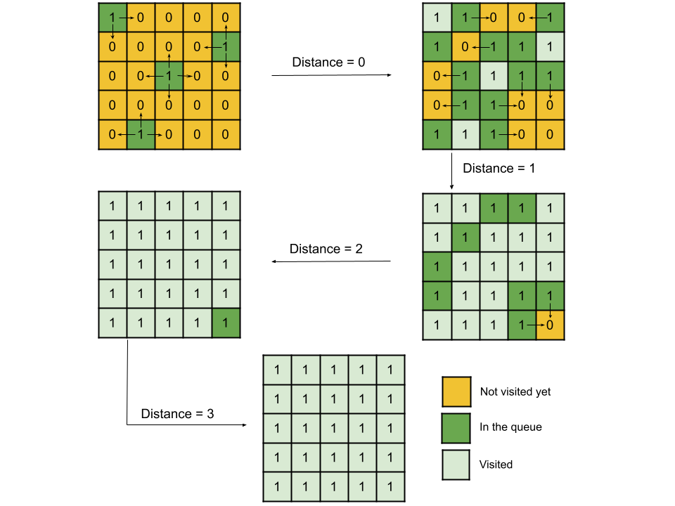

#### Overview

We are given a matrix of size $N*N$ with only `0`s (water cell) and `1`s (land cell). We must find the maximum distance of any `0` to its nearest `1`. In other words, for every cell with a `0` value, we need to find the nearest `1` using manhattan distance, and the maximum distance among all the `0`'s will be the answer.

The brute force approach would be to iterate over the `0`s. For each `0`, find the distance to every `1` in the matrix and take the minimum distance. The maximum of all these minimums will be the answer. This approach, however, is not efficient as in the worst case there could be $\frac{N^2}{2}$ `0`s and $\frac{N^2}{2}$ `1`s; hence the time complexity would be $O(N^4)$, which is not fast enough considering $N$ to be up to `100`.

---

#### Approach 1: Breadth-First Search (BFS)

**Intuition**

Instead of traversing over `0`s and finding the nearest `1` to each, what if we try to iterate from `1`s? One might think of doing the same brute force but in the opposite direction, i.e., for each `1` iterate over `0`s and store the minimum distance for each `0`. But this won't help as we still need to iterate over every pair of `0` and `1`.

We need the shortest distance here for all `0`s; breadth-first search traversal is a kind of traversal which is used for shortest path finding. Generally, we use it to find the shortest distance from a single source or node, but here we have multiple `1`s, so we will use a multi-source breadth-first search. The reason we use BFS from `1`s and not `0`s is that BFS from `0`s will need to be executed individually from each `0` to find its nearest `1`, and hence we will end up exploring every `(0, 1)` pair.

Essentially we will start with all the `1`s, and at each step, we will iterate in all four directions (up, left, right, down) for each `1`. The moment we reach a water cell `0`, we can say that the number of steps we have taken so far is the minimum distance of this water cell from any land cell in the matrix. This way, we will iterate over the whole matrix until all cells are covered; the number of steps we would need to cover the last water cell is the maximum distance we need.



**Algorithm**

1. Iterate over the matrix and insert the land cell coordinates into the queue. Initialize a variable `distance` as `-1` to store the current step of BFS. Also, create a `grid` copy matrix as `visited` to mark the water cells as visited so that we don't insert them into the queue again.

  > Note: The copy matrix `visited` can be avoided by updating the original matrix `grid` but changing the input parameter is not considered under good practices.

2. Perform BFS: Traverse the current elements in the queue, and for each element, check the coordinates in the four directions if they are water cells (`0`). If yes, insert them into the queue and change them to land cell (`1`) in the matrix `visited`.

3. After each level is traversed, i.e., the inner while loop completes, increment the variable `distance`.

4. Repeat the above until the queue becomes empty.

5. Return `distance`. If it is equal to `0`, it means there was no water cell, and the BFS finished after the first step itself, hence returning `-1`. When the matrix doesn't have any land cell, the while loop will not start at all, and hence `distance` will have its initial value (`-1`).

**Implementation**

<details>
  <summary><b>C++</b></summary>

``` c++
class Solution {
public:
    // Four directions: Up, Down, Left and Right.
    const pair<int, int> direction[4] = {{-1, 0}, {1, 0}, {0, -1}, {0, 1}};
    
    int maxDistance(vector<vector<int>>& grid) {
        // A copy matrix of the grid to mark water cells as land once visited.
        int visited[grid.size()][grid[0].size()];
        
        // Insert all the land cells in the queue.
        queue<pair<int, int>> q;
        for (int i = 0; i < grid.size(); i++) {
            for (int j = 0; j < grid[0].size(); j++) {
                // Copy grid to the visited matrix.
                visited[i][j] = grid[i][j];
                if (grid[i][j]) {
                    q.push({i, j});
                }
            }
        }
        
        int distance = -1;
        while (!q.empty()) {
            int qSize = q.size();
            
            // Iterate over all the current cells in the queue.
            while (qSize--) {
                pair<int, int> landCell = q.front();
                q.pop();
                
                // From the current land cell, traverse to all the four directions
                // and check if it is a water cell. If yes, convert it to land
                // and add it to the queue.
                for (pair<int, int> dir : direction) {
                    int x = landCell.first + dir.first;
                    int y = landCell.second + dir.second;
                    
                    if (x >= 0 && y >= 0 && x < grid.size() && y < grid[0].size() && visited[x][y] == 0) {
                        // Marking as 1 to avoid re-iterating it.
                        visited[x][y] = 1;
                        q.push({x, y});
                    }
                }
            }
            
            // After each iteration of queue elements, increment distance 
            // as we covered 1 unit distance from all cells in every direction.
            distance++;
        }
        
        // If the distance is 0, there is no water cell.
        return distance == 0 ? -1 : distance;
    }
};
```
</details>
<details>
  <summary><b>Java</b></summary>

``` java
class Solution {
    // Four directions: Up, Down, Left and Right.
    int[][] direction = new int[][]{{-1, 0}, {1, 0}, {0, -1}, {0, 1}};

    public int maxDistance(int[][] grid) {
        // A copy matrix of the grid to mark water cells as land once visited.
        int[][] visited = new int[grid.length][grid[0].length];

        // Insert all the land cells in the queue.
        Queue<Pair<Integer, Integer>> q = new LinkedList<>();
        for (int i = 0; i < grid.length; i++) {
            for (int j = 0; j < grid[0].length; j++) {
                // Copy grid to the visited matrix.
                visited[i][j] = grid[i][j];
                if (grid[i][j] == 1) {
                    q.offer(new Pair(i, j));
                }
            }
        }

        int distance = -1;
        while (!q.isEmpty()) {
            int qSize = q.size();

            // Iterate over all the current cells in the queue.
            while (qSize-- > 0) {
                Pair<Integer, Integer> landCell = q.poll();

                // From the current land cell, traverse to all the four directions
                // and check if it is a water cell. If yes, convert it to land
                // and add it to the queue.
                for (int[] dir : direction) {
                    int x = landCell.getKey() + dir[0];
                    int y = landCell.getValue() + dir[1];

                    if (x >= 0 && y >= 0 && x < grid.length && y < grid[0].length && visited[x][y] == 0) {
                        // Marking as 1 to avoid re-iterating it.
                        visited[x][y] = 1;
                        q.offer(new Pair(x, y));
                    }
                }
            }

            // After each iteration of queue elements, increment distance 
            // as we covered 1 unit distance from all cells in every direction.
            distance++;
        }

        // If the distance is 0, there is no water cell.
        return distance == 0 ? -1 : distance;
    }
}
```
</details>

**Complexity Analysis**

Here $N$ is the side of the square matrix with size $N \times N$.

- Time complexity: $O(N^2)$.<p>We start traversing from land cells (`1`) and keep iterating over water cells until we convert all water cells to land. Notice that we never insert any cell into the queue twice as we mark the water cell as land when we visit them. Therefore, the time complexity equals $O(N^2)$.</p>
- Space complexity: $O(N^2)$.<p>There could be all cells in the queue at a particular time. Considering the matrix doesn't have any water cells, we insert all the land cells into the queue to initialize and thus will take $O(N^2)$ space. Also, we create `visited`, a copy matrix of `grid`. Hence, the space complexity is $O(N^2)$.</p>

---

#### Approach 2: Dynamic-Programming

**Intuition**

This problem is similar to the [01 Matrix](https://leetcode.com/problems/01-matrix/description/) problem. You may try to solve this problem as the solution discussed here would be very similar.

For every water cell, we need the distance to the nearest land cell. We can reach a cell from any of the four directions: up, down, left and right. Thus, the minimum distance for any cell could be written as the minimum distance of all the cells in these four directions plus one. Therefore, we will need to check all four directions. This is the central intuition behind using Dynamic Programming here as we try to find the answer for a cell using the distance of cells that we have already calculated.

To find the minimum distance for a cell, we will need the minimum distance of all the neighbour's cells. The catch is that we cannot have the minimum distance for all the neighbours in a single traversal. Because if we traverse from top-left to bottom-right, we will have the minimum distance of the upper and left cells as those cells would have already been traversed. Similarly, if we traverse in reverse from the bottom-right to the top-left, we will have the minimum distance of the cells on the right and in the down direction. Hence, we would need two traversals to find the minimum distance for all four neighbours. In the first traversal, we will iterate from top-left to bottom-right and store the minimum distance for cells using the distance of cells in the up and left direction, and then in the second traversal from bottom-right to top-left, to store the minimum distance using the remaining right and down directions.

**Algorithm**

1. Create a 2D array `dist` of the same size as the given `grid` to store the minimum distance from any land cell. Initialize all the cells to `MAX_DISTANCE`, the maximum possible manhattan distance in the matrix + 1.

2. Iterate over the matrix from top-left to bottom-right and for each cell at `(i, j)`:
   a. If the cell is a land cell, i.e., with value `1`, store the minimum distance in the array `dist` as `0`.
   b. If the cell is a water cell, update the distance as the minimum of `grid[i - 1][j]` and `grid[i][j - 1]` plus `1` (If these cells don't exist, use the `MAX_DISTANCE`).

3. Iterate over the matrix from bottom-right to top-left, and for each cell at `(i, j)`, update the distance as the minimum of `grid[i + 1][j]` and `grid[i][j + 1]` plus `1`.

4. Store the maximum of all the values in the array `dist` in the variable `ans`.

5. Return `ans`. If the value of `ans` is `0` or `MAX_DISTANCE`, then return `-1` as these values imply that the matrix doesn't have a water or land cell.

**Implementation**

<details>
  <summary><b>C++</b></summary>

``` c++
class Solution {
public:
    int maxDistance(vector<vector<int>>& grid) {
        int rows = grid.size();
        // Although it's a square matrix, using different variable for readability.
        int cols = grid[0].size();

        // Maximum manhattan distance possible + 1.
        const int MAX_DISTANCE = rows + cols + 1;
        
        vector<vector<int>> dist(rows, vector<int> (cols, MAX_DISTANCE));
        
        // First pass: check for left and top neighbours
        for (int i = 0; i < rows; i++) {
            for (int j = 0; j < cols; j++) {
                // Distance of land cells will be 0.
                if (grid[i][j]) {
                    dist[i][j] = 0;
                } else {
                    // Check left and top cell distances if they exist and update the current cell distance.
                    dist[i][j] = min(dist[i][j], min(i > 0 ? dist[i - 1][j] + 1 : MAX_DISTANCE,
                                                     j > 0 ? dist[i][j - 1] + 1 : MAX_DISTANCE));
                }
            }
        }

        // Second pass: check for right and bottom neighbours.
        int ans = INT_MIN;
        for (int i = rows - 1; i >= 0; i--) {
            for (int j = cols - 1; j >= 0; j--) {
                // Check the right and bottom cell distances if they exist and update the current cell distance.
                dist[i][j] = min(dist[i][j], min(i < rows - 1 ? dist[i + 1][j] + 1 : MAX_DISTANCE,
                                                 j < cols - 1 ? dist[i][j + 1] + 1 : MAX_DISTANCE));
                
                ans = max(ans, dist[i][j]);
            }
        }
        
        // If ans is 0, it means there is no water cell,
        // If ans is MAX_DISTANCE, it implies no land cell.
        return ans == 0 || ans == MAX_DISTANCE ? -1 : ans;
    }
};
```
</details>
<details>
  <summary><b>Java</b></summary>

``` java
class Solution {
    public int maxDistance(int[][] grid) {
        int rows = grid.length;
        // Although it's a square matrix, using different variable for readability.
        int cols = grid[0].length;
        
        // Maximum manhattan distance possible + 1.
        final int MAX_DISTANCE = rows + cols + 1;

        int[][] dist = new int[rows][cols];
        for (int[] arr : dist)
            Arrays.fill(arr, MAX_DISTANCE);

        // First pass: check for left and top neighbours
        for (int i = 0; i < rows; i++) {
            for (int j = 0; j < cols; j++) {
                // Distance of land cells will be 0.
                if (grid[i][j] == 1) {
                    dist[i][j] = 0;
                } else {
                    // Check left and top cell distances if they exist and update the current cell distance.
                    dist[i][j] = Math.min(dist[i][j], Math.min(i > 0 ? dist[i - 1][j] + 1 : MAX_DISTANCE,
                                                               j > 0 ? dist[i][j - 1] + 1 : MAX_DISTANCE));
                }
            }
        }

        // Second pass: check for the bottom and right neighbours.
        int ans = Integer.MIN_VALUE;
        for (int i = rows - 1; i >= 0; i--) {
            for (int j = cols - 1; j >= 0; j--) {
                // Check the right and bottom cell distances if they exist and update the current cell distance.
                dist[i][j] = Math.min(dist[i][j], Math.min(i < rows - 1 ? dist[i + 1][j] + 1 : MAX_DISTANCE,
                                                           j < cols - 1 ? dist[i][j + 1] + 1 : MAX_DISTANCE));
                
                ans = Math.max(ans, dist[i][j]);
            }
        }

        // If ans is 0, it means there is no water cell,
        // If ans is MAX_DISTANCE, it implies no land cell.
        return ans == 0 || ans == MAX_DISTANCE ? -1 : ans;
    }
}
```
</details>

**Complexity Analysis**

Here $N$ is the side of the square matrix with size $N \times N$.

- Time complexity: $O(N^2)$.<p>We iterate over the matrix twice from top to bottom and bottom to top; hence the total time complexity equals $O(N^2)$.</p>
- Space complexity: $O(N^2)$.<p>The only space we need is the matrix `dist` of size $N \times N$ to store the minimum distance for all cells. Therefore, the total space complexity equals $O(N^2)$.</p>

---

#### Approach 3: Space-Optimized Dynamic-Programming

**Intuition**

> Note: This approach needs changing of input parameter `grid` and hence is not an advisable approach. This approach has been added for completion if the interviewer specifically asks for it.

In the previous approach, we create a separate matrix, `dist`, to store the minimum distance. In this approach, we will store this info (minimum distance) in the same given matrix `grid`. The complete algorithm will remain the same, we will iterate over the matrix twice, but this time we will use the original matrix `grid` to store the distance.

**Algorithm**

1. Iterate over the matrix from top-left to bottom-right for each cell at `(i, j)`:
   a. If the cell is a land cell, i.e., with value `1`, store the minimum distance in `grid` as `0`.
   b. If the cell is a water cell, first initialize it to `MAX_DISTANCE` and then update the distance as the minimum of `grid[i - 1][j]` and `grid[i][j - 1]` plus `1` (If these cells don't exist, use the `MAX_DISTANCE`).

2. Iterate over the matrix from bottom-right to top-left, and for each cell at `(i, j)`, update the distance as the minimum of `grid[i + 1][j]` and `grid[i][j + 1]` plus `1`. Also, keep updating the variable `ans` if the updated value in `grid[i][j]` is greater than `ans`.

    Return `ans`. If the value of `ans` is `0` or `MAX_DISTANCE`, then return `-1` as these values imply that the matrix doesn't have a water or land cell.

**Implementation**

<details>
  <summary><b>C++</b></summary>

``` c++
class Solution {
public:    
    int maxDistance(vector<vector<int>>& grid) {
        int rows = grid.size();
        // Although it's a square matrix, using different variable for readability.
        int cols = grid[0].size();

        // Maximum manhattan distance possible + 1.
        const int MAX_DISTANCE = rows + cols + 1;
        
        // First pass: check for left and top neighbours
        for (int i = 0; i < rows; i++) {
            for (int j = 0; j < cols; j++) {
                if (grid[i][j]) {
                    // Distance of land cells will be 0.
                    grid[i][j] = 0;
                } else {
                    grid[i][j] = MAX_DISTANCE;
                    // Check left and top cell distances if they exist and update the current cell distance.
                    grid[i][j] = min(grid[i][j], min(i > 0 ? grid[i - 1][j] + 1 : MAX_DISTANCE,
                                                     j > 0 ? grid[i][j - 1] + 1 : MAX_DISTANCE));
                }
            }
        }

        // Second pass: check for right and bottom neighbours.
        int ans = INT_MIN;
        for (int i = rows - 1; i >= 0; i--) {
            for (int j = cols - 1; j >= 0; j--) {
                // Check the right and bottom cell distances if they exist and update the current cell distance.
                grid[i][j] = min(grid[i][j], min(i < rows - 1 ? grid[i + 1][j] + 1 : MAX_DISTANCE,
                                                 j < cols - 1 ? grid[i][j + 1] + 1 : MAX_DISTANCE));
                ans = max(ans, grid[i][j]);
            }
        }
        
        // If ans is 1, it means there is no water cell,
        // If ans is MAX_DISTANCE, it implies no land cell.
        return ans == 0 || ans == MAX_DISTANCE ? -1 : ans;
    }
};
```
</details>
<details>
  <summary><b>Java</b></summary>

``` java
class Solution {
    public int maxDistance(int[][] grid) {
        int rows = grid.length;
        // Although it's a square matrix, using different variable for readability.
        int cols = grid[0].length;
        
        // Maximum manhattan distance possible + 1.
        final int MAX_DISTANCE = rows + cols + 1;

        // First pass: check for left and top neighbours
        for (int i = 0; i < rows; i++) {
            for (int j = 0; j < cols; j++) {
                if (grid[i][j] == 1) {
                    // Distance of land cells will be 0.
                    grid[i][j] = 0;
                } else {
                    grid[i][j] = MAX_DISTANCE;
                    // Check left and top cell distances if they exist and update the current cell distance.
                    grid[i][j] = Math.min(grid[i][j], Math.min(i > 0 ? grid[i - 1][j] + 1 : MAX_DISTANCE,
                                                               j > 0 ? grid[i][j - 1] + 1 : MAX_DISTANCE));
                }
            }
        }

        // Second pass: check for the bottom and right neighbours.
        int ans = Integer.MIN_VALUE;
        for (int i = rows - 1; i >= 0; i--) {
            for (int j = cols - 1; j >= 0; j--) {
                // Check the right and bottom cell distances if they exist and update the current cell distance.
                grid[i][j] = Math.min(grid[i][j], Math.min(i < rows - 1 ? grid[i + 1][j] + 1 : MAX_DISTANCE,
                                                           j < cols - 1 ? grid[i][j + 1] + 1 : MAX_DISTANCE));
                
                ans = Math.max(ans, grid[i][j]);
            }
        }

        // If ans is 1, it means there is no water cell,
        // If ans is MAX_DISTANCE, it implies no land cell.
        return ans == 0 || ans == MAX_DISTANCE ? -1 : ans;
    }
}
```
</details>

**Complexity Analysis**

Here $N$ is the side of the square matrix with size $N*N$.

- Time complexity: $O(N^2)$.<p>We iterate over the matrix twice from top to bottom and bottom to top; hence the total time complexity equals $O(N^2)$.</p>
- Space complexity: $O(1)$.<p>We don't need extra space, so the space complexity is constant.</p>