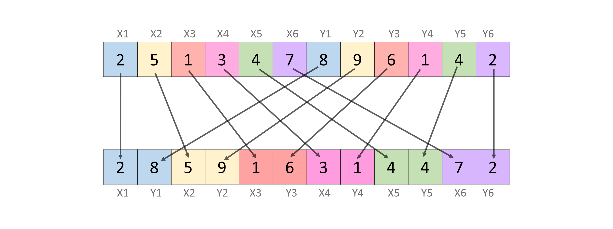
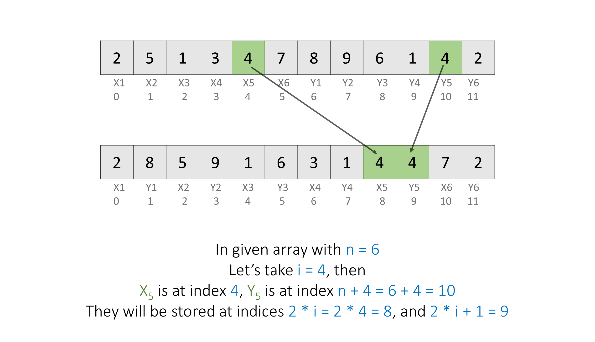
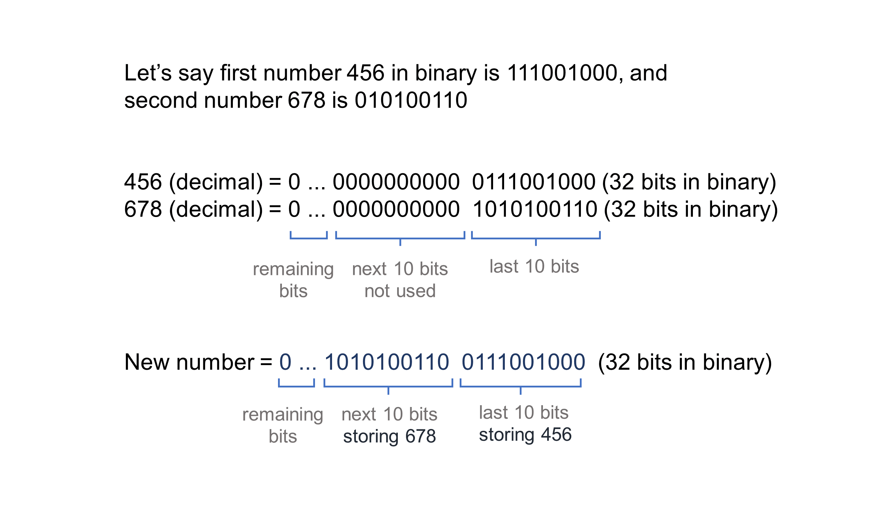
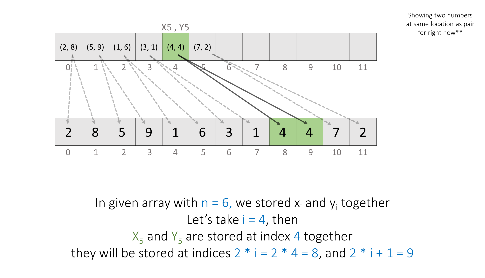
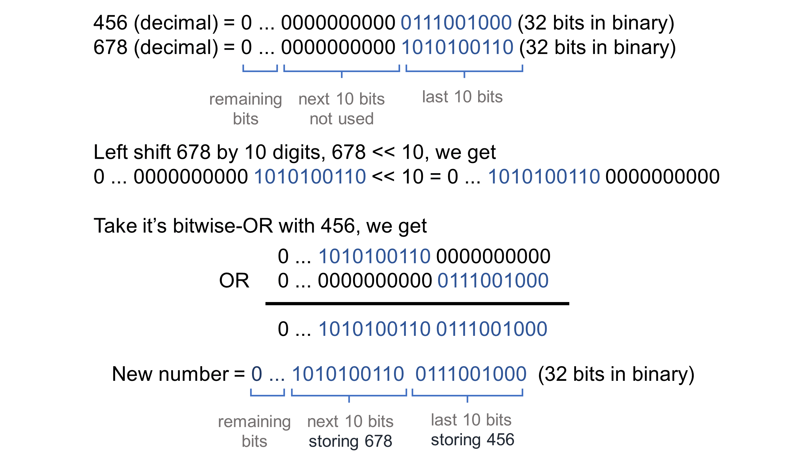
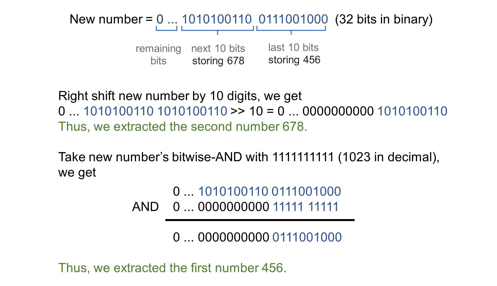

#### Overview

We are given an array $nums$ with $2n$ elements, $[x_1, x_2, \dots , x_n, y_1, y_2, \dots , y_n]$
We need to rearrange the original array as, $[x_1, y_1, x_2, y_2, \dots , x_n, y_n]$.



#### Approach 1: Simple Iteration

**Intuition**

Let us start by trying to identify some patterns in the original array, The elements from $x_1$ to $x_n$ exist from indices $0$ to $n−1$ and elements from $y_1$ to $y_n$ from indices $n$ to $2n−1$. The elements of $x$ should be placed at indices `0, 2, 4, ...`. At `nums[i]` we have element $x_i+1$, we should place it at index $2 \times i$ for all $0 \leqslant i \lt n$.

The elements of $y$ should be placed at indices `1, 3, 5, ...`. At `nums[n + i]` we have element $y_i+1$, we should place it at index $2 \times i+1$ for all $0 \leqslant i \lt n$. Notice that it is the same formula as the previous one but with a $+1$, indicating that elements of $y$ come after elements of $x$.



One of the intuitive ways to solve this is to have an extra array `result` of size $2n$, then iterate over `nums` and place each of its elements at the respective positions in `result`.

**Algorithm**

1. Build an array `result` of size $2n$.
2. Iterate over the `nums` array ranging from indices `0` to `n - 1`:
  - Store the element $x_i+1$, that is `nums[i]` at index `2 * i`, and element $y_i+1$, that is `nums[i + n]` at index `2 * i + 1` in `result`.
3. Return the `result` array.

**Implementation**

<details>
  <summary><b>C++</b></summary>

``` c++
class Solution {
public:
    vector<int> shuffle(vector<int>& nums, int n) {
        vector<int> result(2 * n);
        for (int i = 0; i < n; ++i) {
            result[2 * i] = nums[i];
            result[2 * i + 1] = nums[n + i];
        }
        return result;
    }
};
```
</details>
<details>
  <summary><b>Java</b></summary>

``` java
class Solution {
    public int[] shuffle(int[] nums, int n) {
        int[] result = new int[2 * n];
        for (int i = 0; i < n; ++i) {
            result[2 * i] = nums[i];
            result[2 * i + 1] = nums[n + i];
        }
        return result;
    }
}
```
</details>
<details>
  <summary><b>JavaScript</b></summary>

``` js
var shuffle = function(nums, n) {
    let result = Array(2 * n);
    for (let i = 0; i < n; ++i) {
        result[2 * i] = nums[i];
        result[2 * i + 1] = nums[n + i];
    }
    return result;
};
```
</details>
<details>
  <summary><b>Swift</b></summary>

``` swift
class Solution {
    func shuffle(_ nums: [Int], _ n: Int) -> [Int] {
        var result = Array(repeating: 0, count: 2 * n)
        for i in 0..<n {
            result[2 * i] = nums[i]
            result[2 * i + 1] = nums[n + i]
        }
        return result
    }
}
```
</details>
<details>
  <summary><b>Python 3</b></summary>

``` python
class Solution:
    def shuffle(self, nums: List[int], n: int) -> List[int]:
        result = [0] * (2 * n)
        for i in range(n):
            result[2 * i] = nums[i]
            result[2 * i + 1] = nums[n + i]
        return result
```
</details>

**Complexity Analysis**

Here, $2n$ is the number of elements in the `nums` array.

- Time complexity: $O(n)$.
  - We iterate on $n$ elements of the `nums` array, which takes us $O(n)$ time.
  - Initializing the `result` array will take $O(2n)$ time.
  - Thus, overall we take $O(n+2n)=O(n)$ time.
- Space complexity: $O(1)$.
  - We are not using any additional space other than the output array.

#### Approach 2: In-place Filling

**Intuition**

The previous approach is optimal and sufficient for most interviews. But sometimes the interviewer might come up with a follow-up to perform the changes in-place in the input array without using an output array.

> This approach is much more difficult than the previous one and is included for completeness. Don't be discouraged if you aren't able to come up with it yourself.

So, we can't store the numbers in some additional space. Additionally, rewriting a number will erase the previous value. Hence, here the interviewer would like to check our understanding of bit manipulation.

<details>
  <summary><b>If you are not aware of bit manipulation first, let's get a brief idea about it and look at some basic bitwise operators. (click to expand)</b></summary>

Bit manipulation is the act of manipulating bits, like changing bits of an integer.
At the heart of bit manipulation are the bit-wise operators:

**NOT (~):** Bitwise NOT is a unary operator that flips the bits of the number i.e., if the current bit is $0$, it will change it to $1$ and vice versa.

<pre>
<code>
N = <span style = "color: rgb(181, 206, 168);">5</span> = <span style = "color: rgb(181, 206, 168);">101</span> (<span style = "color: rgb(86, 156, 214)">in binary</span>)
~N = ~(<span style = "color: rgb(181, 206, 168)">101</span>) = <span style = "color: rgb(181, 206, 168);">010</span> = <span style = "color: rgb(181, 206, 168)">2</span> (<span style = "color: rgb(86, 156, 214);">in decimal</span>)
</code>
</pre>

**AND (&):** In bitwise AND if both bits in the compared position of the bit patterns are $1$, the bit in the resulting bit pattern is $1$, otherwise $0$.

<pre>
A = <span style = "color: rgb(181, 206, 168)">5</span> = <span style = "color: rgb(181, 206, 168)">101</span> (<span style = "color: rgb(86, 156, 214)">in binary</span>) 
B = <span style = "color: rgb(181, 206, 168)">1</span> = <span style = "color: rgb(181, 206, 168)">001</span> (<span style = "color: rgb(86, 156, 214)">in binary</span>) 
A & B = <span style = "color: rgb(181, 206, 168)">101</span> & <span style = "color: rgb(181, 206, 168)">001</span> = <span style = "color: rgb(181, 206, 168)">001</span> = <span style = "color: rgb(181, 206, 168)">1</span> (<span style = "color: rgb(86, 156, 214)">in decimal</span>)
</pre>

**OR ( | ):** Bitwise OR is also similar to bitwise AND. If both bits in the compared position of the bit patterns are $0$, the bit in the resulting bit pattern is $0$, otherwise $1$.

<pre>
<span style = "color: rgb(156, 220, 254)">A</span> = <span style = "color: rgb(181, 206, 168)">5</span> = <span style = "color: rgb(181, 206, 168)">101</span> (<span style = "color: rgb(86, 156, 214)">in binary</span>) 
<span style = "color: rgb(156, 220, 254)">B</span> = <span style = "color: rgb(181, 206, 168)">1</span> = <span style = "color: rgb(181, 206, 168)">001</span> (<span style = "color: rgb(86, 156, 214)">in binary</span>) 
<span style = "color: rgb(78, 201, 176)">A</span> | <span style = "color: rgb(78, 201, 176)">B</span> = <span style = "color: rgb(181, 206, 168)">101</span> | <span style = "color: rgb(181, 206, 168)">001</span> = <span style = "color: rgb(181, 206, 168)">101</span> = <span style = "color: rgb(181, 206, 168)">5</span> (<span style = "color: rgb(86, 156, 214)">in decimal</span>)
</pre>

**XOR (^):** In bitwise XOR if both bits are $0$ or $1$, the result will be $0$, otherwise $1$.

<pre>
<span style = "color: rgb(156, 220, 254)">A</span> = <span style = "color: rgb(181, 206, 168)">5</span> = <span style = "color: rgb(181, 206, 168)">101</span> (<span style = "color: rgb(86, 156, 214)">in binary</span>) 
<span style = "color: rgb(156, 220, 254)">B</span> = <span style = "color: rgb(181, 206, 168)">1</span> = <span style = "color: rgb(181, 206, 168)">001</span> (<span style = "color: rgb(86, 156, 214)">in binary</span>) 
<span style = "color: rgb(156, 220, 254)">A</span> ^ <span style = "color: rgb(156, 220, 254)">B</span> = <span style = "color: rgb(181, 206, 168)">101</span> ^ <span style = "color: rgb(181, 206, 168)">001</span> = <span style = "color: rgb(181, 206, 168)">100</span> = <span style = "color: rgb(181, 206, 168)">4</span> (<span style = "color: rgb(86, 156, 214)">in decimal</span>)
</pre>

**Left Shift (<<):** Left shift operator is a binary operator which shifts some number of bits to the left and appends $0$ at the end. One left shift is equivalent to multiplying the bit pattern with $2$.

<pre>
A = <span style = "color: rgb(181, 206, 168)">1</span> = <span style = "color: rgb(181, 206, 168)">001</span> (<span style = "color: rgb(86, 156, 214)">in binary</span>) 
A << <span style = "color: rgb(181, 206, 168)">1</span> = <span style = "color: rgb(181, 206, 168)">001</span> << <span style = "color: rgb(181, 206, 168)">1</span> = <span style = "color: rgb(181, 206, 168)">010</span> = <span style = "color: rgb(181, 206, 168)">2</span> (<span style = "color: rgb(86, 156, 214)">in decimal</span>)
A << <span style = "color: rgb(181, 206, 168)">2</span> = <span style = "color: rgb(181, 206, 168)">001</span> << <span style = "color: rgb(181, 206, 168)">2</span> = <span style = "color: rgb(181, 206, 168)">100</span> = <span style = "color: rgb(181, 206, 168)">4</span> (<span style = "color: rgb(86, 156, 214)">in decimal</span>)

B = <span style = "color: rgb(181, 206, 168)">5</span> = <span style = "color: rgb(181, 206, 168)">00101</span> (<span style = "color: rgb(86, 156, 214)">in binary</span>)
B << <span style = "color: rgb(181, 206, 168)">1</span> = <span style = "color: rgb(181, 206, 168)">00101</span> << <span style = "color: rgb(181, 206, 168)">1</span> = <span style = "color: rgb(181, 206, 168)">01010</span> = <span style = "color: rgb(181, 206, 168)">10</span> (<span style = "color: rgb(86, 156, 214)">in decimal</span>)
B << <span style = "color: rgb(181, 206, 168)">2</span> = <span style = "color: rgb(181, 206, 168)">00101</span> << <span style = "color: rgb(181, 206, 168)">2</span> = <span style = "color: rgb(181, 206, 168)">10100</span> = <span style = "color: rgb(181, 206, 168)">20</span> (<span style = "color: rgb(86, 156, 214)">in decimal</span>)
</pre>

**Right Shift (>>):** Right shift operator is a binary operator which shifts some number of bits to the right and appends $0$ at the left side. One right shift is equivalent to dividing the bit pattern with $2$.

<pre>
A = <span style = "color: rgb(181, 206, 168)">4</span> = <span style = "color: rgb(181, 206, 168)">100</span> (<span style = "color: rgb(86, 156, 214)">in binary</span>) 
A >> <span style = "color: rgb(181, 206, 168)">1</span> = <span style = "color: rgb(181, 206, 168)">100</span> >> <span style = "color: rgb(181, 206, 168)">1</span> = <span style = "color: rgb(181, 206, 168)">010</span> = <span style = "color: rgb(181, 206, 168)">2</span> (<span style = "color: rgb(86, 156, 214)">in decimal</span>)
A >> <span style = "color: rgb(181, 206, 168)">2</span> = <span style = "color: rgb(181, 206, 168)">100</span> >> <span style = "color: rgb(181, 206, 168)">2</span> = <span style = "color: rgb(181, 206, 168)">001</span> = <span style = "color: rgb(181, 206, 168)">1</span> (<span style = "color: rgb(86, 156, 214)">in decimal</span>)
A >> <span style = "color: rgb(181, 206, 168)">3</span> = <span style = "color: rgb(181, 206, 168)">100</span> >> <span style = "color: rgb(181, 206, 168)">3</span> = <span style = "color: rgb(181, 206, 168)">000</span> = <span style = "color: rgb(181, 206, 168)">0</span> (<span style = "color: rgb(86, 156, 214)">in decimal</span>)
<br />
B = <span style = "color: rgb(181, 206, 168)">5</span> = <span style = "color: rgb(181, 206, 168)">00101</span> (<span style = "color: rgb(86, 156, 214)">in binary</span>)
B >> <span style = "color: rgb(181, 206, 168)">1</span> = <span style = "color: rgb(181, 206, 168)">00101</span> >> <span style = "color: rgb(181, 206, 168)">1</span> = <span style = "color: rgb(181, 206, 168)">00010</span> = <span style = "color: rgb(181, 206, 168)">2</span> (<span style = "color: rgb(86, 156, 214)">in decimal</span>)
</pre>
</details>

Now coming back to our problem, we can see that the maximum possible value of an element of the `nums` array is $10^3$ which is $1111101000$ in binary.
Thus each element will take at most $10$-bits in a $32$-bit integer and the remaining bits are $0$ and not used.

This suggests the idea that in the remaining empty unused bits we can store some extra information. One possible solution is storing two numbers together (the first number in the first ten bits and the second in the next ten bits) without using additional space.



We will store the last $n$ numbers with the first $n$ numbers of the `nums` array. Thus, $x_i$ and $y_i$ are stored at $i^th$ index.

And then we can store the numbers at their respective positions after starting iteration on the stored pairs from index $(n−1)$ to index $0$.
We would like to move in this direction (right to left) because, even if the right side elements are overwritten, we will not use those overwritten elements again because the current index \($i$\) having a number pair will always be less or equal to the updated cells \($i \leqslant 2 \times i$ and $2 \times i+1$\).
Thus, the overwritten elements would have already been placed at their correct positions earlier.



**Storing two numbers together:**

$a$ is the first number, $b$ is the second number.

We can left shift $b$ by $10$ bits and take its bitwise-OR with $a$.
When we take any bit's bitwise-OR with $0$, it results in the same bit, and $1$ results in $1$.

The first $10$ bits in $b_{new}$ are $0$. So, when we take its bitwise-OR with $a$, the result's first $10$ bits will have $a$'s $10$ bits, and the next $10$ bits of $a$ are $0$, so the result's next $10$ will store $b$'s $10$ bits there.
Thus the final result has bits of both $a$ and $b$.



**Extracting both numbers:**

$result$ is the number having both numbers: $a$ (first number) and $b$ (second number).

$result$'s first $10$ bits contain $a$. Thus, we can retrieve it by taking bitwise-AND with $0000000000 1111111111$ ($1023$ in decimal).
When we take a bit's AND with $1$ it results in the same bit and with $0$ results in $0$.

$result$'s next $10$ bits contain $b$, thus we can retrieve it by right shifting it by $10$ bits.



**Algorithm**

1. Iterate on the `nums` array from index `i = n` to `2 * n - 1`:
  - Store the element $y_i+1$, that is, `nums[i]` with $x_i+1$ at index `(i - n)`, using bit manipulation as discussed previously.
2. Iterate from index `n - 1` to `0`, and at each index `i`:
  - Extract both firstNumber and secondNumber using bit manipulation and store them at their respective indices `2 * i` and `2 * i + 1` in the `nums` array.
3. Return the `nums` array.

**Implementation**

<details>
  <summary><b>C++</b></summary>

``` c++
class Solution {
public:
    vector<int> shuffle(vector<int>& nums, int n) {
        // Store each y(i) with respective x(i).
        for (int i = n; i < 2 * n; ++i) {
            int secondNum = nums[i] << 10;
            nums[i - n] |= secondNum;
        }

        // '0000000000 1111111111' in decimal.
        int allOnes = pow(2, 10) - 1;

        // We will start putting all numbers from the end, 
        // as they are empty places.
        for (int i = n - 1; i >= 0; --i) {
            // Fetch both the numbers from the current index.
            int secondNum = nums[i] >> 10;
            int firstNum = nums[i] & allOnes;
            nums[2 * i + 1] = secondNum;
            nums[2 * i] = firstNum;
        }
        return nums;
    }
};
```
</details>
<details>
  <summary><b>Java</b></summary>

``` java
class Solution {
    public int[] shuffle(int[] nums, int n) {
        // Store each y(i) with respective x(i).
        for (int i = n; i < 2 * n; ++i) {
            int secondNum = nums[i] << 10;
            nums[i - n] |= secondNum;
        }

        // '0000000000 1111111111' in decimal.
        int allOnes = (int) Math.pow(2, 10) - 1;

        // We will start putting all numbers from the end, 
        // as they are empty places.
        for (int i = n - 1; i >= 0; --i) {
            // Fetch both the numbers from the current index.
            int secondNum = nums[i] >> 10;
            int firstNum = nums[i] & allOnes;
            nums[2 * i + 1] = secondNum;
            nums[2 * i] = firstNum;
        }
        return nums;
    }
}
```
</details>
<details>
  <summary><b>JavaScript</b></summary>

``` js
var shuffle = function(nums, n) {
    // Store each y(i) with respective x(i).
    for (let i = n; i < 2 * n; ++i) {
        let secondNum = nums[i] << 10;
        nums[i - n] |= secondNum;
    }

    // '0000000000 1111111111' in decimal.
    let allOnes = Number(Math.pow(2, 10)) - 1;

    // We will start putting all numbers from the end, 
    // as they are empty places.
    for (let i = n - 1; i >= 0; --i) {
        // Fetch both the numbers from the current index.
        let secondNum = nums[i] >> 10;
        let firstNum = nums[i] & allOnes;
        nums[2 * i + 1] = secondNum;
        nums[2 * i] = firstNum;
    }
    return nums;
};
```
</details>
<details>
  <summary><b>Python 3</b></summary>

``` python
class Solution:
    def shuffle(self, nums: List[int], n: int) -> List[int]:
        # Store each y(i) with respective x(i).
        for i in range(n, 2 * n):
            secondNum = nums[i] << 10
            nums[i - n] |= secondNum

        # '0000000000 1111111111' in decimal.
        allOnes = int(pow(2, 10)) - 1

        # We will start putting all numbers from the end, 
        # as they are empty places.
        for i in range(n - 1, -1, -1):
            # Fetch both the numbers from the current index.
            secondNum = nums[i] >> 10
            firstNum = nums[i] & allOnes
            nums[2 * i + 1] = secondNum
            nums[2 * i] = firstNum
        return nums
```
</details>

**Complexity Analysis**

Here, $2n$ is the number of elements in the `nums` array.

- Time complexity: $O(n)$.
  - We only iterate on the $n$ elements of the `nums` array twice, which takes us $O(n)$ time.
- Space complexity: $O(1)$.
  - We are not using any additional space.