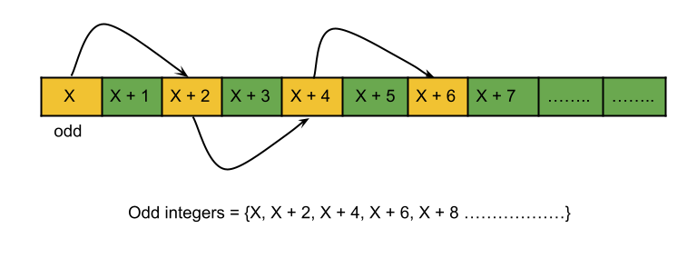

#### Approach 1: Maths

**Intuition**

We have two non-negative integers, `low` and `high`, and we need to find the number of odd integers in between, including them. The brute force way of solving this problem would be to iterate over each number from `low` to `high` and check if the number is odd and increment a counter variable accordingly. The time complexity of this approach would be $O(high−low)$, and `high - low` could be up to $10^9$, and hence this is not feasible. Another way would be to find the following odd number after `low` and then keep taking a jump of $2$ (because there is exactly one even number between every two consecutive odd numbers) and count the number of odd integers. This approach is still inefficient as the number of operations here would be `(high - low) / 2`, and hence the time complexity would still be $O(high−low)$.

Let's start with an odd integer, say $x$; what would be the next odd integer? It would be $x + 2$; as explained above, there is exactly one even integer between every two odd integers, and hence all odd integers are equally spaced with a gap of one integer. By trying out some examples, we can deduce that the count of odd integers between $x$ and a greater integer $y$ where $x$ is odd would be $\dfrac{y - x}{2} + 1$. Let's see the mathematical proof.

We need to find the count of odd integers between an odd integer $x$ and an integer $y$. In total, there are $y - x$ integers between them excluding $y$, and every other number is odd. Thus, the number of odd numbers can be written as $\dfrac{y - x}{2}$. The important point to note here is that the above formula always leaves out the last odd integer in the range (let's say $x = 1$, $y = 3$, then the formula gives us $1$ as it leaves out the $3$) and hence we need to add $1$. Therefore we have $\dfrac{y - x}{2} + 1$ odd integers between $x$ and $y$, when $x$ is odd.

Now, the only part remaining is to find the odd integer greater than or equal to `low` and then we can find out the number of odd integers from that integer to `high` using the above formula. It can be easily observed that if a number is not odd, its following number would be odd. Hence we will check if `low` is odd; if not, we can just increment it, which would be our starting point ($x$ in the above discussion).



**Algorithm**

1. Check if `low` is odd. This could be easily checked using `%` operator, but we used bit wise operator `&` as they are more efficient.
2. If `low` is odd, increment it.
3. Return `(high - low) / 2 + 1`. The important point here is to check that if `low` after incrementing became greater than `high` this will happen when `low = high`, and in that case, we should return `0`.

**Implementation**

<details>
  <summary><b>C++</b></summary>

``` c++
class Solution {
public:
    int countOdds(int low, int high) {
        // If low is even, make it odd.
        if (!(low & 1)) {
            low++;
        }
  
        // low could become greater than high due to incrementation
        // if it is, the answer is 0; otherwise, use the formula.
        return low > high ? 0 : (high - low) / 2 + 1;
    }
};
```
</details>
<details>
  <summary><b>Java</b></summary>

``` java
class Solution {
  public int countOdds(int low, int high) {
    // If low is even, make it odd.
    if ((low & 1) == 0) {
      low++;
    }

    // low could become greater than high due to incrementation
    // if it is, the answer is 0; otherwise, use the formula.
    return low > high ? 0 : (high - low) / 2 + 1;
  }
}
```
</details>

**Complexity Analysis**

- Time complexity: $O(1)$.<p>We are using bit-wise and other arithmetic or relational operator that all cost us $O(1)$ time. Hence the time complexity would be constant.</p>
- Space complexity: $O(1)$.<p>No extra variable or space is needed, and hence the space complexity would be constant.</p>