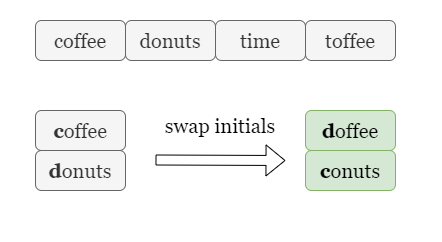

#### Overview

In this problem, we are given an array of strings `ideas` containing different names.



We can pick two different names from `ideas` and swap their first letters. Take the picture above as an example, if we pick coffee and donuts and swap their initials, we will get doffee and conuts, if these two generated names are not in `ideas`, then they form a valid name coffee donuts.

Our task is to find out the number of distinct valid names. Note that if a pair of words `a, b` form a valid name, then `b, a` will also form a valid name.

---

#### Approach 1: Group words by their initials

**Intuition**

Let's start with the most intuitive solution, which is to try every pair of words and count the number of valid names created, as shown in the picture below. (The x2 is to indicate that a pair of words forms two valid names, one for each ordering, take the first swap as an example, if we can swap coffee with donuts to generate a valid name, we can also swap donuts with coffee to generate the second valid name).


However, given the size of the input array `ideas` as $n$, we need to try $O(n^2)$ pairs of words. This approach is likely to exceed the time limit, implying that we should look for a better approach.

We notice that if two words have the same initial letter, swapping them will not create any new word.


Hence, we can group the suffixes of all words in `ideas` by their initials, take apple as an example, we store pple in a set marked with the letter **a**.

Since swapping any two words from the same group always creates two invalid names, we only need to try swapping words from two different groups.


For two groups with initial letters `a` and `b`, if a suffix `suffix` is contained by both groups, then swapping `a` + `suffix` with any other words in group `b` is invalid, as the new name `b` + `suffix` is already in group `b`. Similarly, swapping `b` + `suffix` with any other words in group a is invalid as well since `a` + `suffix` is already in group `a`.

> Here `a` and `b` are variables representing letters, not the literals `"a"` and `"b"`

Hence, two words `a` + `suffix_a` and `b` + `suffix_b` can be swapped to generate two new names only if their suffixes are distinct, that is, neither `suffix_a` is in group `b` nor `suffix_b` is in group `a`.


Therefore, we need to try every pair of initial letters `a` and `b`, then find the numbers of distinct suffixes in both groups. We can swap every distinct suffix in group `a` with every distinct suffix in group `b` to make two valid company names.

We can get the number of distinct suffixes by first getting the number of mutual suffixes `num_of_mutual` in both groups. The number of distinct suffixes equals the size of one group minus `num_of_mutual`.

**Algorithm**

1. Group words in `ideas` by their initials in `initial_group`, an array of sets of length 26, and initialize `answer` as `0`.

2. Iterate over every pair of groups. For each group `i` and `j`, get the number of suffixes `num_of_mutual` that appears in both groups.

3. We can swap every distinct suffix in group `i` with every distinct suffix in group `j`, increment `answer` by `2 * (len(group[i]) - num_of_mutual) * (len(group[j]) - num_of_mutual)`

4. Return `answer`.

**Implementation**

<details>
  <summary><b>C++</b></summary>

``` c++
class Solution {
public:
    long long distinctNames(vector<string>& ideas) {
        // Group idea by their initials.
        unordered_set<string> initialGroup[26];
        for (auto& idea : ideas)
            initialGroup[idea[0] - 'a'].insert(idea.substr(1));
        
        // Calculate number of valid names from every pair of groups.
        long long answer = 0;
        for (int i = 0; i < 25; ++i) {
            for (int j = i + 1; j < 26; ++j) {
                // Get the number of mutual suffixes.
                int numOfMutual = 0;
                for (auto& ideaA : initialGroup[i]) {
                    if (initialGroup[j].count(ideaA)) {
                        numOfMutual++;
                    }
                }

                // Valid names are only from distinct suffixes in both groups.
                // Since we can swap a with b and swap b with a to create two valid names, multiple answer by 2.
                answer += 2LL * (initialGroup[i].size() - numOfMutual) * (initialGroup[j].size() - numOfMutual);
            }
        }
        return answer;
    }
};
```
</details>
<details>
  <summary><b>Java</b></summary>

``` java
class Solution {
    public long distinctNames(String[] ideas) {
        // Group idea by their initials.
        HashSet<String>[] initialGroup = new HashSet[26];
        for (int i = 0; i < 26; ++i) {
            initialGroup[i] = new HashSet<>();
        }
        for (String idea : ideas) {
            initialGroup[idea.charAt(0) - 'a'].add(idea.substring(1));
        }
        
        // Calculate number of valid names from every pair of groups.
        long answer = 0;
        for (int i = 0; i < 25; ++i) {
            for (int j = i + 1; j < 26; ++j) {
                // Get the number of mutual suffixes.
                long numOfMutual = 0;
                for (String ideaA : initialGroup[i]) {
                    if (initialGroup[j].contains(ideaA)) {
                        numOfMutual++;
                    }
                }

                // Valid names are only from distinct suffixes in both groups.
                // Since we can swap a with b and swap b with a to create two valid names, multiple answer by 2.
                answer += 2 * (initialGroup[i].size() - numOfMutual) * (initialGroup[j].size() - numOfMutual);
            }
        }
        
        return answer;
    }
}
```
</details>
<details>
  <summary><b>Python 3</b></summary>

``` python
class Solution:
    def distinctNames(self, ideas: List[str]) -> int:
        # Group idea by their initials.
        initial_groups = [set() for _ in range(26)]
        for idea in ideas:
            initial_groups[ord(idea[0]) - ord('a')].add(idea[1:])
        
        answer = 0
        # Calculate number of valid names from every pair of groups.
        for i in range(25):
            for j in range(i + 1, 26):
                # Get the number of mutual suffixes.
                num_of_mutual = len(initial_groups[i] & initial_groups[j]) 
                
                # Valid names are only from distinct suffixes in both groups.
                # Since we can swap a with b and swap b with a to create two valid names, multiple answer by 2.
                answer += 2 * (len(initial_groups[i]) - num_of_mutual) * (len(initial_groups[j]) - num_of_mutual)
                
        return answer
```
</details>

**Complexity Analysis**

Let $n$ be the number of words in `ideas` and $m$ be the average length of a word.

- Time complexity: $O(n \times m)$
  - We group words in `ideas` by their initials, it takes $O(m)$ time to hash a string of length $m$, thus it takes $O(n \times m)$ time to hash and store $n$ strings.
  - We need to try every pair of initials, there are $26 \times 25 / 2 = 325$ pairs of initials. For each pair of groups, we need to find the number of mutual suffixes by iterating one of the groups which takes up to $O(n \times m)$ time.
  - To sum up, the time complexity is $O(325 \times n \times m)$ = $O(n \times m)$.
- Space complexity: $O(n \times m)$
  - We store the suffixes of all words in an array of sets, it takes $O(n \times m)$ space.